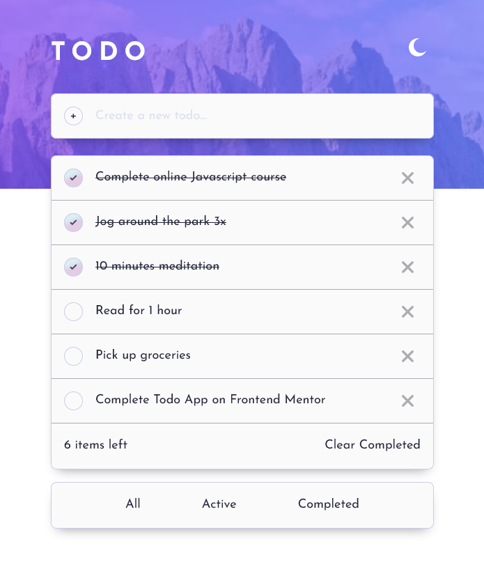

# Frontend Mentor - Todo app solution

This is a solution to the [Todo app challenge on Frontend Mentor](https://www.frontendmentor.io/challenges/todo-app-Su1_KokOW). Frontend Mentor challenges help you improve your coding skills by building realistic projects. 

## Table of contents

- [Overview](#overview)
  - [The challenge](#the-challenge)
  - [Links](#links)
- [My process](#my-process)
  - [Built with](#built-with)
  - [What I learned](#what-i-learned)
  - [Continued development](#continued-development)
  - [Useful resources](#useful-resources)
- [Author](#author)

## Overview

### The challenge

Users should be able to:

- View the optimal layout for the app depending on their device's screen size
- See hover states for all interactive elements on the page
- Add new todos to the list
- Mark todos as complete
- Delete todos from the list
- Filter by all/active/complete todos
- Clear all completed todos
- Toggle light and dark mode


### Links

- Solution URL: [Github Repo](https://github.com/kebin20/todo-app-react)
- Live Site URL: [Todo App](https://sunny-griffin-804c1b.netlify.app/)

## My process

### Built with

- Semantic HTML5 markup
- CSS custom properties
- Flexbox
- Mobile-first workflow
- [Vite](https://vitejs.dev/) - Build Tool
- [React](https://reactjs.org/) - JS library

### What I learned

Coding this app had taught me a a lot when modifying the states of an array, in this case the Todo items array. 

I learnt that in order to update the todoitem state (which holds an array of objects), I have to first need to create a copy of the current todoitem state using the spread operator (https://developer.mozilla.org/en-US/docs/Web/JavaScript/Reference/Operators/Spread_syntax). 

This todolist was also great practice in using a variety of array methods in JavaScript  such as .unshift(), .map() and .filter(). 


```jsx
  function addTodoHandler(enteredText) {
    setTodoItem((prevTodoItem) => {
      const updatedTodo = [...prevTodoItem];
      updatedTodo.unshift({ text: enteredText, id: Math.random().toString() });
      return updatedTodo;
    });
  }

  function deleteTodoHandler(itemId) {
    setTodoItem((prevTodoItem) => {
      const updatedTodo = prevTodoItem.filter((item) => item.id !== itemId);
      return updatedTodo;
    });
  }

  function checkItem(itemId) {
    setTodoItem((prevTodoItem) => {
      const updatedTodo = prevTodoItem.map((todo) => {
        if (todo.id === itemId) {
          return {
            ...todo,
            isChecked: !todo.isChecked,
          };
        }
        return todo;
      });
      return updatedTodo;
    });
  }
```

I also learnt how to store the todo items in local storage, thanks to a Freecodecamp article which was very helpful.

```jsx
  useEffect(() => {
    const storedTodo = JSON.parse(localStorage.getItem('todoItem'));
    if (storedTodo) {
      setTodoItem(storedTodo);
    }
  }, []);

  useEffect(() => {
    localStorage.setItem('todoItem', JSON.stringify(todoItem));
  }, [todoItem]);
```

### Continued development

I think I need to learn a more effective way of doing styling for react components so I'm thinking of learning about styled components and possibly using tailwind for React projects. I also may want to get used to using CSS modules more but I was struggling to create conditional logic with it. 
Of course I will also need to get used to learning on how to use the variety of JavaScript methods used for projects.

I could also refactor this project more by putting more repeated code within my context component and expand it beyond changing the theme.

### Useful resources

- [Stack Overflow](https://stackoverflow.com/questions/52950627/inline-style-in-react-background-linear-gradient) - This helped me for styling the background and adding a tick svg inside the checkbutton

- [MDN Docs](https://developer.mozilla.org/en-US/docs/Web/JavaScript/Reference/Global_Objects/Array/filter) - The goto for documentation on array methods, this one in particular helped me with the filter() method.

- [Bobbyhadz](https://bobbyhadz.com/blog/react-set-body-style) - This is a great article which helped me learn how to set styling on the body element in a React app.

- [freeCodeCamp - Joel Olewanle](https://www.freecodecamp.org/news/how-to-use-localstorage-with-react-hooks-to-set-and-get-items/) - This is a great article which helped me learn how to use localStorage to store new todoitems and it's state.


## Author

- Frontend Mentor - [@kebin20](https://www.frontendmentor.io/profile/kebin20)


  <!-- /* Fetching todo function (USING localStorage)*/

  // useEffect(() => {
  //   const storedTodo = JSON.parse(localStorage.getItem("todoItem"));
  //   if (storedTodo) {
  //     setTodoItem(storedTodo);
  //   }
  // }, []);

  // useEffect(() => {
  //   localStorage.setItem("todoItem", JSON.stringify(todoItem));
  // }, [todoItem]); -->


